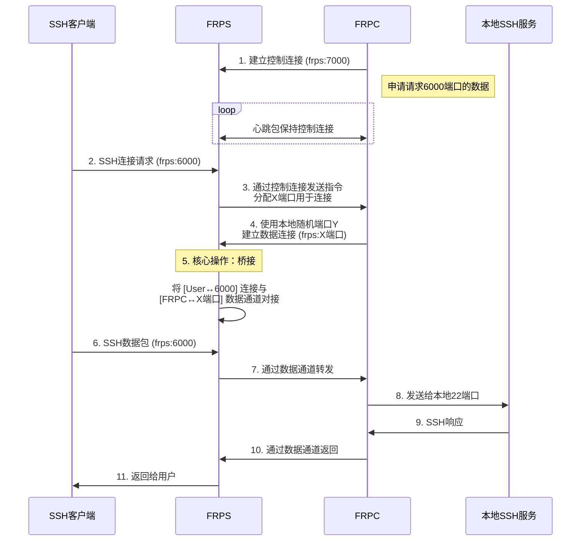

跟[上次用frp]()差不多，不过这次是在Linux上，不用桌面只是ssh。

在[发布界面](https://github.com/fatedier/frp/releases/)下载frp，由于服务器已经配置好了只用配置客户端。

编辑`frpc.toml`

```toml
serverAddr = "0.0.0.0" # 替换为服务器IP
serverPort = 7000 #与frps.toml保持一致

log.to = "./frpc.log"
log.level = "info"
log.maxDays = 3

auth.method = "token"
auth.token = "111" #与frps.toml保持一致

transport.tls.enable = true # 传输使用tls加密确实是有用的，不写也可以因为默认开启

[[proxies]] # 这里应该不能改为别的名字，改了会报错，我也没仔细看实例
name = "ssh"
type = "tcp"
localIP = "127.0.0.1"
localPort = 22  # ssh默认端口 
remotePort = 6000
```

然后要开启防火墙，只需要开启7000端口的出站就可以，还可以指定ip，使用ufw，`sudo ufw allow out to 123.123.123.123 port 7000 proto tcp`

然后数据从7000端口向服务器的7000端口发出连接申请，通过后在7000端口返回（这里不用配置入站因为防火墙默认允许返回数据），建立连接。之后就将frpc的22端口映射到了frps的6000端口（配置文件写的），这样有ssh连接到了frps的6000端口，就会由通过由frpc向frps申请到新的tcp连接传递到22端口，通信开始。



然后可以手动运行`./frpc -c frpc.toml`，应该是没有输出，但是frps的日志会显示连接成功。(注意不要开启代理，全局代理也会转发端口引发不必要的混乱)

同样可以创建systemd服务，在`/etc/systemd/system/frpc.service`

```service
[Unit]
Description=FRP Clinet Service

[Service]
Type=simple
# WorkingDirectory=/usr/local/frp # 这里设置工作目录不知道有没有用，注释掉了，还是要用绝对路径
ExecStart=/usr/local/frp/frpc -c /usr/local/frp/frpc.toml
Restart=always
RestartSec=10

[Install]
WantedBy=multi-user.target
```

之后就可以用systemd管理。

```bash
sudo systemctl daemon-reload
sudo systemctl start frpc.service
sudo systemctl enable frpc.service
sudo systemctl status frpc.service
```

## 关于ssh登录

在ssh客户端机器使用`ssh-keygen -t ed25519`生成密钥对，保存在自定位置，然后可以直接使用`ssh-copy-id -i /path/to/ssh.pub -p 6000 user@ip`，直接将公钥添加到要连接的ssh机器上的`~/.ssh/authorized_keys`中。

然后记得禁用密码登录，在`/etc/ssh/sshd_config`

```config
PasswordAuthentication no   # 将 yes 改为 no
PubkeyAuthentication yes    # 确保这是 yes
```

可以配置`~/.ssh/config`让登录更方便。

```config
Host frpc
  HostName 123.123.123.123
  Port 6000
  IdentityFile path/to/ssh/key
  User username
```

这样就可以使用`ssh frpc`代替`ssh -p 6000 -i path/to/ssh/key username@123.123.123.123`
