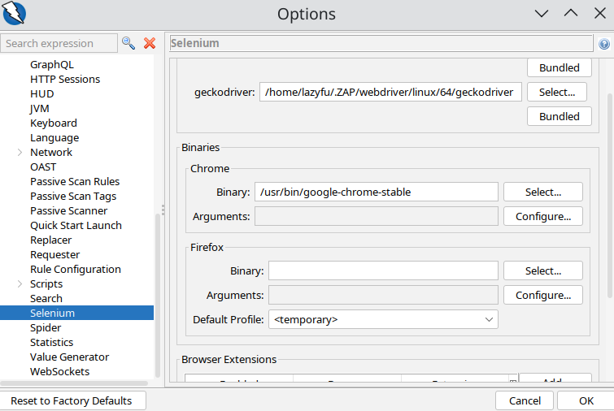

选了一门安全编程技术，主要讲Java漏洞挖掘，其实我也不知道什么东西没怎么听课。然后期末作业找个靶场练习写报告，之前我就发现了WebGoat，觉得渗透测试很符合我的气质，然后学一学看一看。

一开始还好好的，我用的docker，运行的也很正常

```bash
docker run -it -p 127.0.0.1:9080:8080 -p 127.0.0.1:9090:9090 --name webgoat webgoat/webgoat
```

这里`-it`是交互模式，在终端显示输出，其实`-d`也可以。然后我改了端口映射，用了9080和9090，因为后边的zap要用到8080。

浏览器访问`http://127.0.0.1:8080/WebGoat`就可以了。

然后用zap的时候，我先是在mac上安装，然后打不开浏览器，上网查了一下说很正常很常见，然后就想手动打开，也配置代理也修改端口就是检测不到流量。我甚至还用docker运行了zap，还是不行。折腾一下午真的很烦人，我就想上Linux看看吧（不用windows是因为windows已经一坨了我不想装软件弄得乱七八糟的），结果Linux上也打不开浏览器，配置代理也没用。上网看到说要在设置里改文件地址，改了也不行。



最后看到firefox配置代理比较方便，就装了个firefox试试，结果什么都没配置自己就打开了，真是服了。兼容性还得是firefox吗，这浏览器乱七八糟的烦死人了（BTW，本来我在Linux装的是firefox,但是我们学校网站不兼容我就删了换chrome了，其实学校网站也没打开几次）。
